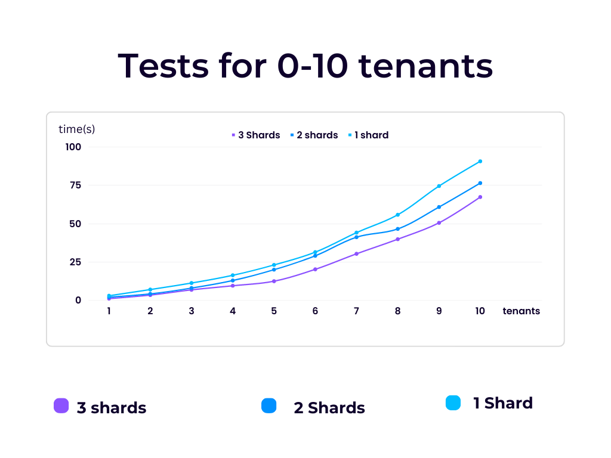
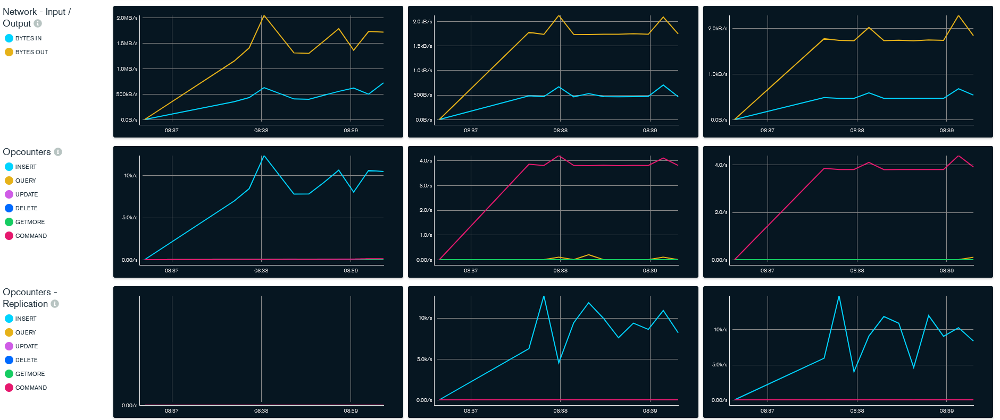

# Part  1
## 1. Explain your choice of the application domain and corresponding types of data to be supported and technologies for mysimbdp-coredms. Explain under which situations/assumptions, your platform serves for big data workload 
The application domain for mysimbdp-coredms is big data storage and management. The types of data to be supported can vary widely since I am using a NoSQL database, including structured and unstructured data, as well as text, images, and multimedia data. For the project I am only using one dataset -> one type of data as instructed.

For this platform, the technologies used are a Flask API and MongoDB. Flask is used for building the API for data insertion, and MongoDB is used for storing and managing the data. A replica set cluster is used for high availability and to ensure that data is always available, even if a single node goes down.

This platform is well-suited for big data workloads under the following situations/assumptions:

    High data volume: The platform can handle large amounts of data and could potentially scale to meet the demands of a growing business.
    High data velocity: The platform can handle fast data ingestion rates, making it suitable for real-time and near real-time data processing.  (Especially with better hardware/ hosted in the cloud)
    High data variety: The platform can store and manage a wide range of data types, including structured, semi-structured, and unstructured data.
    High data variability: The platform can handle rapidly changing data and adapt to changing data patterns.

## 2. Design and explain the interactions among main platform components in your architecture of mysimbdp. Explain which would be the third parties (services/infrastructures) that you do not develop for your platform. 
    mysimbdp-dataingest: This component reads data from external data sources and then passes the data to the mysimbdp-coredms component using mysimbdp-daas.
    mysimbdp-coredms: This component acts as the main storage for the platform. It receives data from mysimbdp-daas, stores it, and makes it available to other components in the platform through APIs.
    mysimbdp-daas: This component acts as a middle man between external data consumers and mysimbdp-coredms. It exposes APIs that allow external data consumers to access and ingest the data stored in mysimbdp-coredms.

In terms of third-party services and infrastructures, mysimbdp will rely on external data sources for data ingestion and storage. Some common data sources can include file systems, databases, messaging systems, and cloud storage services. Additionally, mysimbdp could leverage on third-party tools for data processing and analysis, such as Apache Spark or Apache Hadoop but that's outside the assignment scope.
##  3. Explain a configuration of a cluster of nodes for mysimbdp-coredms so that you prevent a single-point-of-failure problem for mysimbdp-coredms for your tenants 
To prevent single-point-of-failure I set up a cluster of nodes using replicasets in MongoDB. Replica sets provide automatic failover by maintaining multiple copies of data across multiple nodes, ensuring that if one node fails, the data remains available. I developed my project to work locally. In a real world scenario this would not be optimal and you would want to spread out the nodes on different machines since if they are all on one machine they all fail if the machine fails.
##  4. You decide a pre-defined level of data replication for your tenants/customers. Explain the level of replication in your design, how many nodes are needed in the deployment of mysimbdp-coredms for your choice so that this component can work property (e.g., the system still supports redundancy in the case of a failure of a node
My configuration is as follows:
1. One primary shard responsible for handling all write operations
2. Two secondary shards that maintain a copy of the data from the primary node and are available to handle read operations and take over if the primary node fails.
3. The same setup inside the shards with nodes instead.
## 5.  Explain how would you scale mysimbdp to allow many tenants using mysimbdp-dataingest to push data into mysimbdp
I opted to solve this by using a REST API which acts as a middleman forwarding the requests. I go more into detail on how scaling could be done in part 2 question 5.

# Part 2
## 1.  Design, implement and explain one example of the data schema/structure for a tenant whose data will be stored into mysimbdp-coredms
I opted to use MongoDB for mysimbdp-coredms. MongoDB is a JSON document database. I opted to deploy it locally to make testing easier for others + I was curious about setting up sharding myself locally.
The data that tenants ingest is tortoise monitoring data from a Ruuvi tag. The JSON data structure to be ingested per row from the csv looks like the following:

    { "_id" : ObjectId("63ec9d5b300c718f113f449e"),
        "time" : NumberLong("1526083320375"),
        "readable_time" : "2018-05-12T00:02:00.375000Z",
        "acceleration" : 1014.6920715172656,
        "acceleration_x" : -68, 
        "acceleration_y" : 376,
        "acceleration_z" : 940,
        "battery" : 2941, 
        "humidity" : 33, 
        "pressure" : 1023.59,
        "temperature" : 23.67, 
        "dev-id" : "C2:9A:9F:E5:58:27" }
The data is ingested into the database "assignment1" and the collection "tortoise_data". The data I use has 15577 rows of data.
## 2. Given the data schema/structure of the tenant (Part 2, Point 1), design a strategy for data partitioning/sharding, explain the goal of the strategy (performance, data regulation and/or what), and explain your implementation for data partitioning/sharding together with your design for replication in Part 1, Point 4, in mysimbdp-coredms 
For data partitioning/sharding, a good strategy could be to partition the data based on the unique device identifier, as each device would likely have a different rate of data generation and different access patterns. This would allow for more efficient querying and data retrieval, as well as potentially improving data regulation by keeping data from different devices separate. Upon further inspecting the data I noticed that there only seems to be one device identifier per CSV and 3 in total. This is too little cardinality for sharding. I opted to use the "time" field instead as it had a relatively even distribution and a moderate amount of cardinality. In a real world scenario with more devices the dev-id field would make more sense since then each device would have their own shard.

For replication, I'm doing a master-slave replication setup, where one node is designated as the master and all writes are directed to it. The master then replicates the writes to the slave nodes, which can handle read requests. This approach provides improved fault tolerance and availability, as well as  improves data consistency by ensuring that all nodes have the same data.

Reference: https://github.com/minhhungit/mongodb-cluster-docker-compose
## 3. Assume that you are the tenant, write a mysimbdp-dataingest that takes data from your selected sources and stores the data into mysimbdp-coredms. Explain what would be the atomic data element/unit to be stored. Explain possible consistency options for writing data in your mysimdbp-dataingest 
The atomic data element/unit in this schema is a single monitoring event of a device, containing information about the timestamp of the event, the acceleration measurements on the x, y, and z axes, battery level, humidity, pressure, temperature, and the device ID.

Consistency options for writing data into mysimdbp-coredms include:

    Strong consistency: The data will be immediately replicated to all nodes in the cluster before the write operation is acknowledged as complete, ensuring that all replicas have the same data.
    Eventual consistency: The write operation is acknowledged as soon as the data is written to the primary node, but the replicas may not have the same data until later. The system will eventually converge to a consistent state.
    Consistent prefix reads: When reading data, the system will return a prefix of the writes that have been acknowledged as complete. This provides a weaker consistency guarantee than strong consistency but allows for higher performance.
## 4. Given your deployment environment, measure and show the performance (e.g., response time,throughputs, and failure) of the tests for 1,5, 10, .., n of concurrent mysimbdp-dataingest writingdata into mysimbdp-coredms with different speeds/velocities together with the change of thenumber of nodes of mysimbdp-coredms. Indicate any performance differences due to the choice of consistency options
Below is a chart depicting test results on how long it takes for n tenants to simultaneously ingest data with different amounts of shards. Please note that since the project is run via docker, there isn't a lot of computing power in the containers -> the times should only be used to portray differences in relation to eachother. 

There seems to be a noticeable drop in performance as shards are removed. More statistics can be seen by setting up monitoring as instructed in deployment.

Example of how the monitor tool looks like under load with multiple tenants simultaneously ingesting data.

## 5. Observing the performance and failure problems when you push a lot of data into mysimbdp-coredms (you do not need to worry about duplicated data in mysimbdp), propose the change of your deployment to avoid such problems (or explain why you do not have any problem with your deployment)
When ingesting a lot of data using many tenants at once the performace of the system degrades. Notably it becomes very slow. The issue could be solved via two main options:

Horizontal scaling: I would increase the number shards and the amount of nodes in the clusters depending on the load in order to distribute the load on more nodes.

Load Balancing: Load balancing would optimize the distribution of requests ensuring that the all nodes get an equal amount of requests.

Vertical scaling: Increase the capacity of the server(s). More powerful hardware

Use of Queuing Systems:  This would store incoming data ingestion requests in a queue and process them in an orderly manner. E.g. Apache Kafka or RabbitMQ
# Part 3
## 1. Using your mysimdbp-coredms, a single tenant can create many different databases/datasets. Assume that you want to support the tenant to manage metadata about the databases/datasets, what types of metadata you would like to support? Can you provide one example of using the metadata to find a dataset?
In the context of mysimdbp-coredms, a single tenant can create multiple databases or datasets. To support the management of metadata related to these databases or datasets, we may want to consider various types of metadata such as data source, creation date, owner, or access permissions.

For example, if a tenant wants to find a particular dataset, they could search for it based on its creation date, owner, or other metadata fields to quickly locate the dataset they need. Having robust metadata support can help tenants efficiently manage and access their data in mysimdbp-coredms. Examples would be:

    Dataset name: A unique name to identify the dataset
    Description: A brief description of the dataset to provide more context
    Owner: The owner or creator of the dataset
    Creation date: The date when the dataset was created
    Last updated: The date when the dataset was last updated
    Schema: The structure and fields of the dataset
## 2. Assume that each of your tenants/users will need a dedicated mysimbdp-coredms. Design the data schema of service information for mysimbdp-coredms that can be published into an existing registry (like ZooKeeper, consul or etcd) so that you can find information about which mysimbdp-coredms is for which tenants/users
    {
    "tenant_id": "12345",
    "service_name": "mysimbdp-coredms",
    "host": "xx.x.xx.x.x",
    "port": "xxxxx",
    "username": "user",
    "password": "password"
   
    }
Using this schema each instance of mysimbdp-coredms would be identified by the tenant id field. Service name would specify the name of the service e.g mysimbdp-core-dms-nameoftenantACME and the rest are pretty self explanatory
## 3. Explain how you would change the implementation of mysimbdp-dataingest (in Part 2) to integrate a service discovery feature (no implementation is required)
To integrate a service discovery feature we could use for example ZooKeeper. Zookeeper would periodically update a registry of mysimbdp-coredms instances.
mysimbdp-dataingest would need to have at least the following changes:
    1. Enable the service discovery tool and connect to the registry
    2. When connecting to the db the service discovery tool would need to be used to find the appropriate instance.
## 4. Assume that now only mysimbdp-daas can read and write data into mysimbdp-coredms, how would you change your mysimbdp-dataingest (in Part 2) to work with mysimbdp-daas?
Pretty much how I have it setup now. mysimbdp-dataingest forwards the data to mysimbdp-daas APIS which in turn forward the data to mysimbdp-coredms. Essentially using mysimbdp-daas as a middleman.

